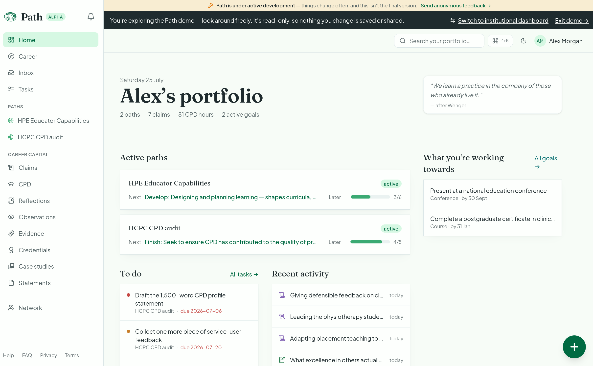
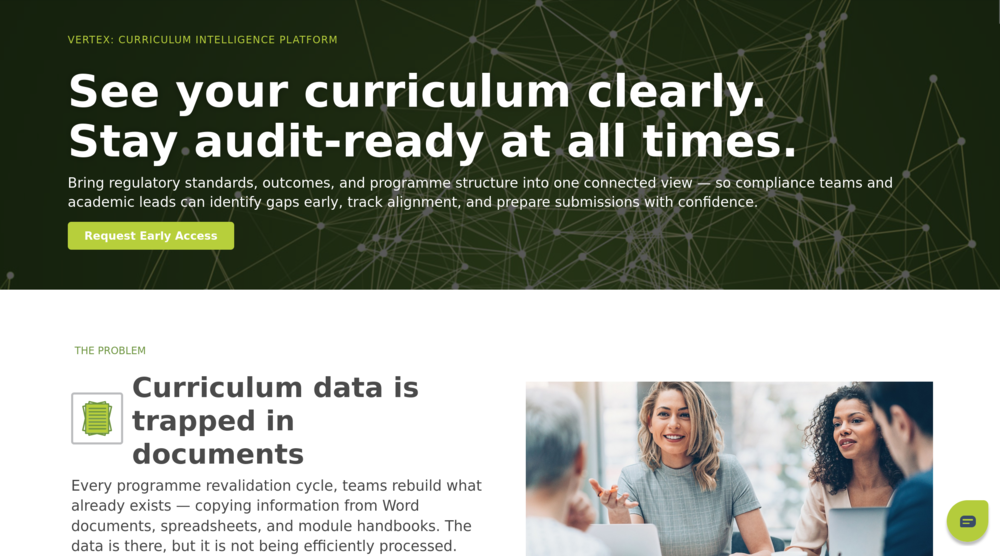
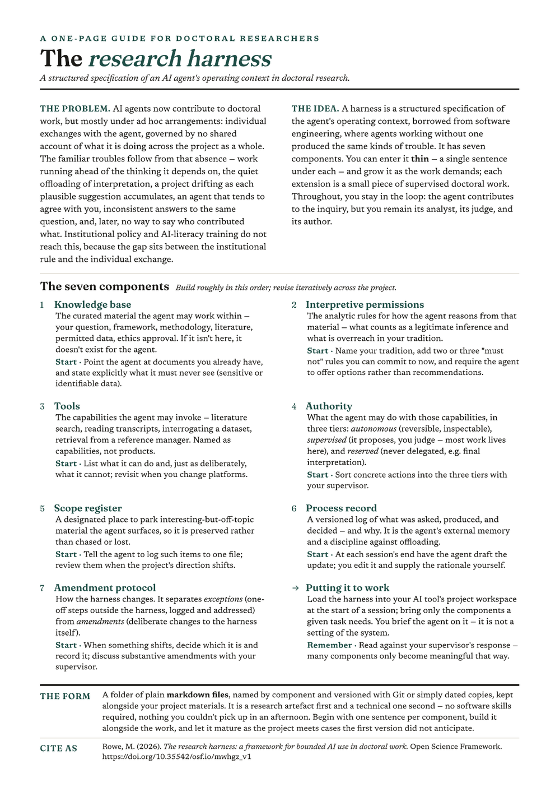
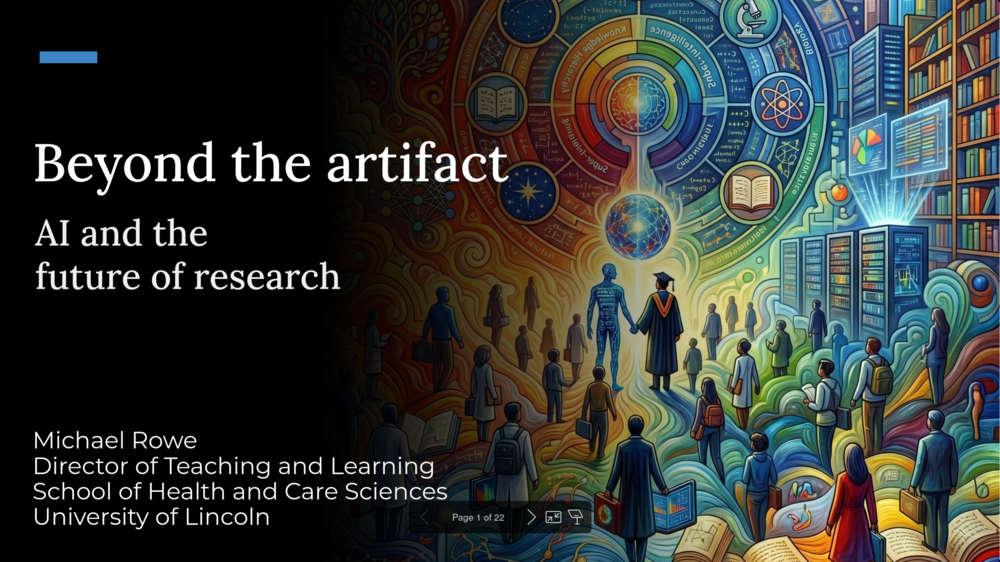
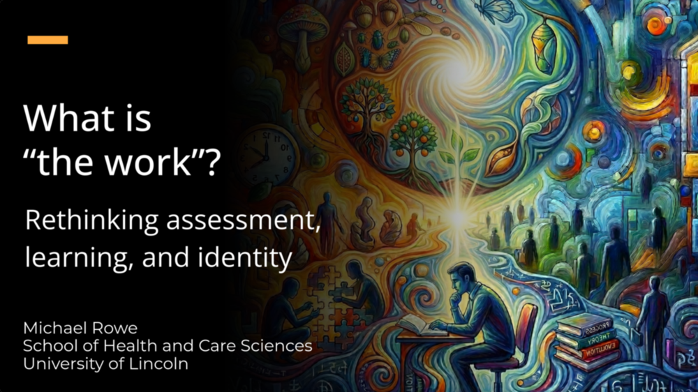
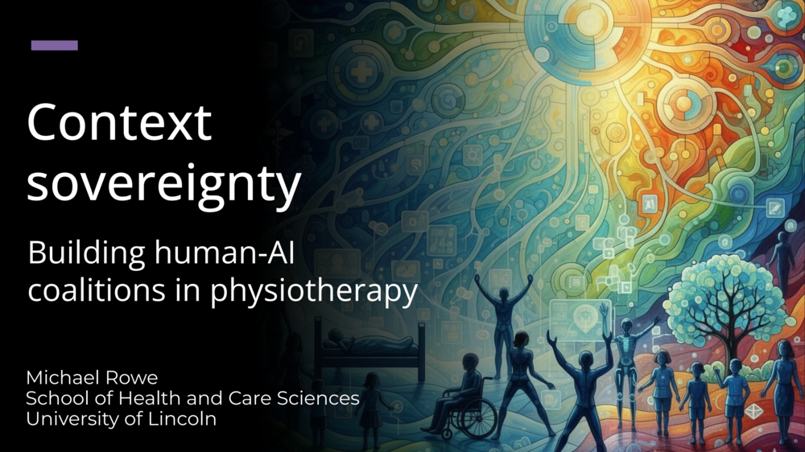
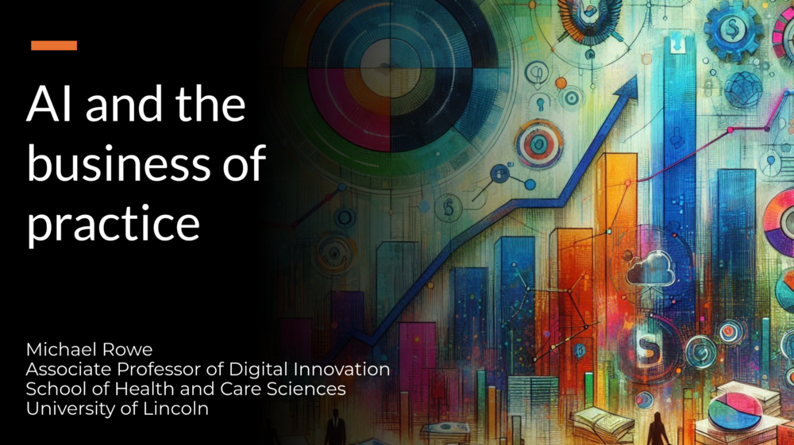
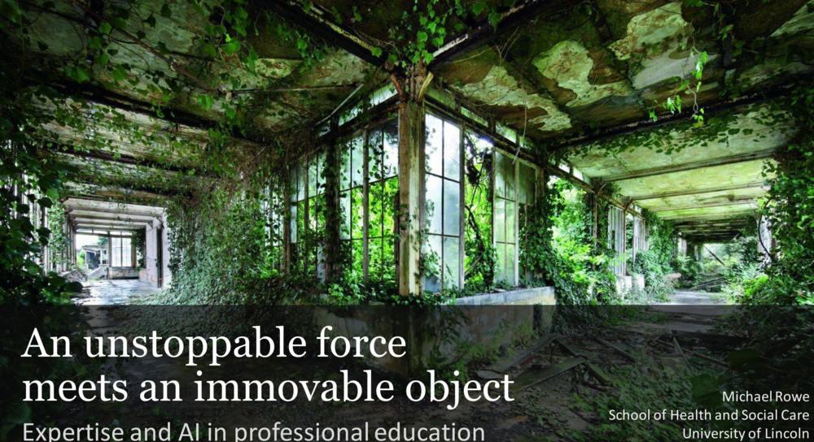
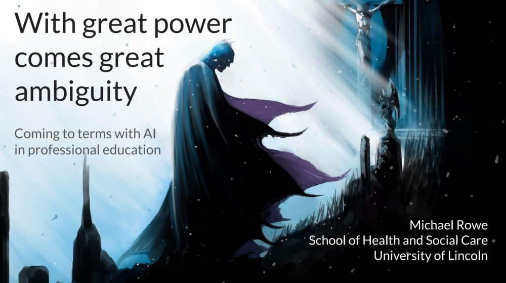

I'm an Associate Professor and Director of Teaching and Learning at the University of Lincoln. For most of my academic career my work has been informed by one question: how we learn to do difficult things well. Teaching, technology and research all answer part of it, and AI has recently become central to that conversation. I try to work in public following the traditions of open scholarship and open source software, where ideas are developed in the open so that others can see and use them. This is partly because I think knowledge belongs to more people than currently hold it, and partly because the work gets better when others can check it.

[[newsletter|Subscribe]] [[contact|Get in touch]]

## Projects

The projects I'm working on right now, mostly focused on professional development, quality assurance, and learning support.

<a href="Projects/path"><strong>Path</strong>: a portfolio tool that works towards a standard, so the evidence accumulates as you go rather than being assembled the week before a deadline.</a>

<a href="Projects/vertex"><strong>Vertex</strong>: a curriculum knowledge graph for natural-language querying, quality assurance, and compliance.</a>

<a href="Projects/research-harness">The <strong>research harness</strong>: a structured operating context for working with AI agents in doctoral research.</a>

## A place to start

If you're new here, these are representative of the work:

- A post on [[Posts/2026-03-07-ai-personas-for-professional-practice|building AI personas for professional practice]], and why the real leverage with AI isn't prompt engineering but knowing your professional commitments well enough to turn them into context an AI can work within.
- A course I built on developing [[Courses/AI literacy/index|AI literacy for academics]], across six dimensions from basic competence to transformation.
- A one-page guide explaining the design principles of my [[Guides/ai-hpe-framework-guide|theoretical framework for integrating AI]] into health professions education.
- An essay on [[Essays/problem-based-learning-structural-conditions-ai|problem-based learning and AI]], arguing that the features that make PBL work — collaborative inquiry, facilitation, and metacognition — are the same conditions that make AI integration educationally productive.
- My latest [[Newsletters|monthly newsletter]], asking what we still contribute once the machine does the work better than we do, alongside a few reads and quotes from the past couple of months.

## Testimonials

> As a member of our AI and Emerging Technology expert panel, Michael played a pivotal role in shaping our proposals for the review of the Standards of Education and Training — strengthening the standards on technology use and our commitment to fairness and accessibility.
> — *Madeleine Connor, Chair, HCPC Standards of Education and Training review*

> Michael brings the content across with real passion. My students aren't native English speakers, but they understood it through his clearly formulated examples — one told me afterwards, "this session made me look at AI in a completely different way."
> — *Erwin Van de Put, Thomas More University of Applied Sciences, Belgium*

## Presentations

I'm often invited to speak about teaching, research and scholarly practice, and what AI is changing about them; here are some of my favourite presentations from the past couple of years.

<a href="Presentations/2026-04-24-beyond-the-artifact-prs">Physiotherapy Research Society keynote (2026)</a>

<a href="Presentations/2026-04-15-what-is-the-work-rcn">Royal College of Nursing Education keynote (2026)</a>

<a href="Presentations/2025-11-21-csp-founders-context-sovereignty">CSP Founders' Lecture (2025)</a>

<a href="Presentations/2025-09-18-ai-business-practice-lmc">Lincolnshire Local Medical Committee (2025)</a>

<a href="Presentations/2023-11-24-an-unstoppable-force-meets-an-immovable-object">ADAPT International Conference keynote (2023)</a>

<a href="Presentations/2023-10-06-with-great-power-comes-great-ambiguity">ENPHE conference keynote (2023) — I loved working on this one</a>

Beyond the talks, I'm co-authoring [a book on AI for doctoral researchers](https://www.researchmasterminds.com/ai-and-your-doctorate) with Springer Nature and leading a chapter in a Springer reference volume on AI in medical education.

## Explore

Browse by [[formats|format]] or [[topics|topic]], or see what's [[recently-added|recently added]].

---

> [!NOTE] Previous writing
> My earlier work lives at [mrowe.co.za](https://www.mrowe.co.za/blog/) (AI and technology-enhanced scholarship) and [Head Space](https://academic-headspace.com/) (calm productivity and sustainable scholarship). Those are now legacy archives; all new work is published here.

If you spot a gap, an error, or something worth adding to the site, [open an issue on GitHub](https://github.com/michael-rowe/home-michael/issues/new). If you want to respond to any of it, [[contact|I'd love to hear from you]].
